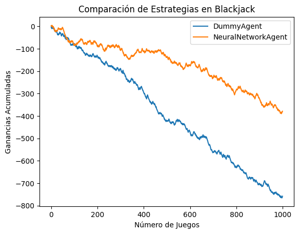
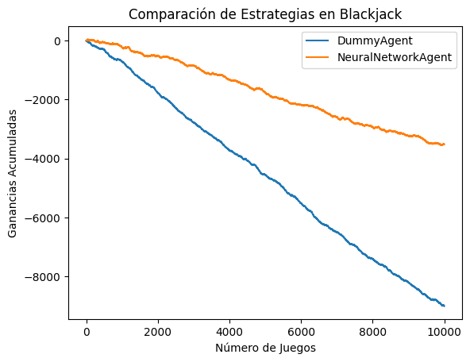

# Redes Neurales y Algoritmos Genéticos para el Blackjack

Este proyecto presenta una metodología avanzada para abordar la resolución del Blackjack con diversos enfoques: integración de redes neuronales, aprendizaje por refuerzo y algoritmos genéticos. El proyecto incorpora técnicas de simulaciones de Montecarlo, con el fin de evaluar y optimizar las estrategias del juego.


## Implementación 

```bash 
├── agents_evaluation.ipynb
├── core
│   ├── agenetico.py
│   ├── agents.py
│   ├── __init__.py
│   ├── montecarlo.py
│   ├── networks.py
│   └── q-learning.py
├── juego
│   ├── estado.py
│   ├── __init__.py
│   └── jugador.py
├── mc_1000.csv
├── montecarlo.ipynb
├── neural_training.ipynb
├── README.md
├── resources
│   ├── pretrained
│   │   └── dnn_5000000.h5
│   └── simulaciones
│       ├── mc_5000000.csv
└── tests
    ├── auto_exec.sh
    ├── test_01_aux.py
    ├── test_02_jugador.py
    ├── test_03_estado.py
    └── test_04_juego.py
```

CORE
- core/montecarlo: clase para simular partidas de blackjack y guardar los resultados
- core/networks:   clase para definir redes neuronales con diversas arquitecturas. Input - estado actual y acción | Output - vector de 3 posiciones (probabilidad de cada resultado posible en base a un estado y una acción)
- core/agentes:    clase para definir agentes con estrategias diferentes, y evaluar su resultado.
- core/q-learning: clase para implementar el algoritmo Q-Learning aplicado al blackjack

JUEGO
- juego/__init_:   clase Juego, define el blackjack, sus reglas, y el flujo de ejecución
- juego/estado:    clase para definir un estado del juego
- juego/jugador:   clase para definir un juegador


## Resultados

#### DummyAgent vs NeuralNetworkAgent 1000 


#### DummyAgent vs NeuralNetworkAgent 10000



## Aspectos Teóricos

### Simulaciones de Montecarlo

Se emplean simulaciones de Montecarlo para modelar las interacciones del juego y establecer una correlación funcional entre el estado del juego y los resultados numéricos de cada ronda. Estas simulaciones ayudan a transformar el problema en una tarea de clasificación multiclase, con posibles resultados de -1, 0 o 1.


### Arquitecturas de Redes Neuronales

Se investigan diversas arquitecturas de redes neuronales, con un enfoque particular en las CNNs, para analizar y predecir los resultados basándose en el estado del juego. Estas redes se diseñan para capturar las relaciones y patrones complejos inherentes a las configuraciones de las cartas en el Blackjack.


### Algoritmos Genéticos y Redes Neuronales

La combinación de algoritmos genéticos con redes neuronales se explora para optimizar las estrategias de juego. Los algoritmos genéticos permiten refinar los parámetros de las redes neuronales, mejorando su habilidad para identificar y actuar según los patrones del juego.


### Aprendizaje por Refuerzo

El aprendizaje por refuerzo se utiliza para evaluar estrategias y tomar decisiones informadas en el juego. Esta técnica facilita una comprensión más profunda de las consecuencias a largo plazo de las acciones en juegos que incluyen elementos de azar, como el Blackjack.

## Recursos 

https://es.scribd.com/doc/92066804/Beat-the-Dealer-Edward-O-Thorp
